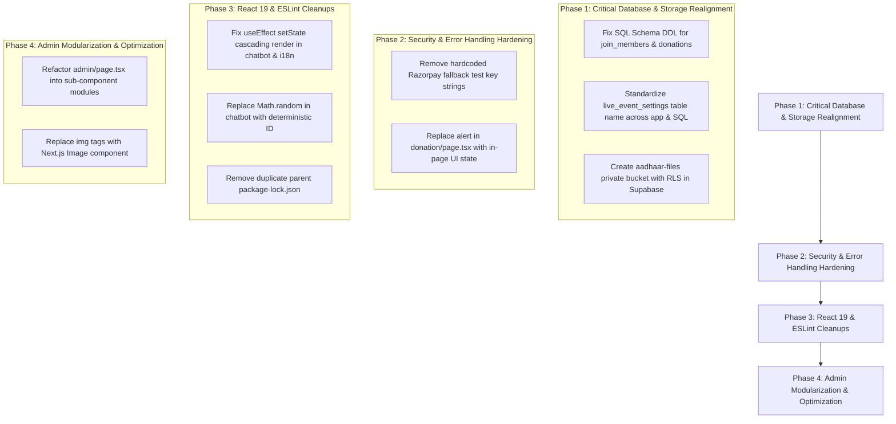

# Technical & Functional Audit Report
**Project Name:** Hanuman Pushpavarsha Committee Website  
**Root Location:** `/Users/ayushtiwari/hamumanpushpvarsha/hanumanpushpavarsha`  
**Date of Audit:** October 8, 2026  
**Status:** Audit Completed — No code fixes applied as instructed.

---

## 1. Executive Summary
The **Hanuman Pushpavarsha Committee** web application is a Next.js (v16.2.6 App Router with Turbopack) application built with React 19, TypeScript, Tailwind CSS (v4), Framer Motion, Lenis smooth scrolling, Supabase (SSR/JS SDK v2), and Razorpay payment integration.

### Primary Audit Highlights:
- **Build Status:** The production build (`npm run build`) compiles successfully into 10 static routes and 1 dynamic route (`/api/razorpay`). However, Next.js emits a workspace root warning due to an extra `package-lock.json` in the parent directory (`/Users/ayushtiwari/hamumanpushpvarsha`).
- **ESLint & TypeScript Integrity:** Running `npx eslint .` revealed **67 problems (50 errors, 17 warnings)**. Notable errors include improper React state calls inside `useEffect` in `chatbot.tsx` and `language-context.tsx`, impure `Math.random` usage during render in `chatbot.tsx`, unescaped HTML entities, and multiple TypeScript `any` types.
- **Database & Supabase Schema Mismatch:** There is a **critical architectural disconnect** between what `admin/page.tsx` and public pages query versus the provided `supabase-schema.sql`. Specifically:
  - `admin/page.tsx` reads `live_event_settings`, while `supabase-schema.sql` defines `live_status`.
  - `admin/page.tsx` uploads member files to bucket `aadhaar-files`, but `supabase-schema.sql` does not create or set policies for `aadhaar-files`.
  - `gallery/page.tsx` falls back to hardcoded mock dictionaries if Supabase album tables are empty or unpopulated.
- **Language / i18n System:** A custom Context (`LanguageProvider` in `language-context.tsx`) provides English (`en`) and Hindi (`hi`) translations. Switching works dynamically across key UI sections, but some pages (`gallery/page.tsx`, `members/page.tsx`, `community/page.tsx`) maintain local dictionary objects that duplicate or override the central context.
- **Security & Secrets:** `.env.local` contains Supabase URL/Anon Key and Razorpay test credentials. However, hardcoded fallback Razorpay test keys (`[REDACTED_RAZORPAY_KEY_ID]`) exist as string literals in `join/page.tsx` and `donation/page.tsx`.

---

## 2. Project Architecture & Directory Structure

```text
Hanuman Pushpavarsha Web System
│
├── Frontend (Next.js 16.2 App Router)
│   ├── Layouts & Providers: src/app/layout.tsx, src/components/providers.tsx, src/lib/language-context.tsx
│   ├── Core Navigation & UI: src/components/ui/navbar.tsx, footer.tsx, chatbot.tsx, spiritual-background.tsx
│   └── Pages: Home (/), About (/#about), History (/history), Members (/members), 
│              Community (/members/community), Gallery (/gallery), Live (/live), 
│              Join (/join), Donation (/donation), Admin (/admin)
│
├── Backend / API Layer
│   └── Razorpay Order API: POST /api/razorpay (src/app/api/razorpay/route.ts)
│
├── External Integrations & Storage
│   ├── Supabase DB & Auth: User authentication, join_members, donations, gallery_albums, live_event_settings
│   ├── Supabase Storage: member-photos, aadhaar-files, gallery-photos, events
│   └── Razorpay Checkout: Client-side checkout.js popup for ₹1100 membership and custom donations
│
└── Configuration & Schema
    ├── Environment: .env.local (Supabase URL, Anon Key, Razorpay Keys)
    └── DB Schema: supabase-schema.sql
```

---

## 3. Technology Stack

| Layer | Technology / Library | Version | Usage / Notes |
| ----- | ------------------- | ------- | ------------- |
| **Framework** | Next.js (App Router, Turbopack) | `16.2.6` | Core SSR/SSG application framework |
| **UI Library** | React & React DOM | `19.2.4` | Component framework |
| **Language** | TypeScript | `^5` | Strict type checking |
| **Styling** | Tailwind CSS & `@tailwindcss/postcss` | `^4` | Utility-first styling with custom spiritual theme |
| **Animations** | Framer Motion & GSAP | `^12.40.0`, `^3.15.0` | Micro-interactions and animated shader hero |
| **Smooth Scroll** | Lenis | `^1.3.23` | Smooth page scrolling provider |
| **Icons** | Lucide React | `^1.16.0` | UI icon set |
| **Backend / DB** | Supabase JS & SSR | `^2.106.2`, `^0.10.3` | Auth, Postgres database, Storage buckets |
| **Payments** | Razorpay SDK | `^2.9.6` | Order creation API route & client-side checkout |
| **Utility & Forms** | `clsx`, `tailwind-merge`, `zod`, `react-hook-form` | Various | Form validation and class merging |

---

## 4. Complete Route Inventory

| URL Path | File Location | Purpose | Rendering Type | Current Status | Identified Issues / Risks |
| -------- | ------------- | ------- | -------------- | -------------- | ------------------------ |
| `/` | `src/app/page.tsx` | Main landing page (Hero, About, Stats, Events, Donation Appeal) | Static (○) | ✅ Working | WebGL Canvas warning on animated shader hero; `` tags used instead of `next/image`. |
| `/history` | `src/app/history/page.tsx` | Committee journey, spiritual mission, 1995–2020 timeline | Static (○) | ✅ Working | Static mock data only; does not query backend. |
| `/members` | `src/app/members/page.tsx` | Committee leadership & static executive members | Static (○) | ⚠️ Partial | Queries `join_members` from Supabase, but falls back to static hardcoded members if DB query fails. |
| `/members/community` | `src/app/members/community/page.tsx` | Approved community members list | Static (○) | ⚠️ Partial | ESLint `any` errors & `useEffect` dependency warnings; queries `join_members`. |
| `/gallery` | `src/app/gallery/page.tsx` | Photo gallery grouped by years (2021–2026) | Static (○) | ⚠️ Partial | Queries `gallery_albums` and `gallery_photos`. Has extensive 940-line hardcoded dictionary fallback. |
| `/live` | `src/app/live/page.tsx` | Live stream player (YouTube embed / Instagram link) & ticker | Static (○) | ⚠️ Partial | Table mismatch: Queries `live_event_settings`, but `supabase-schema.sql` defines `live_status`. |
| `/join` | `src/app/join/page.tsx` | Membership registration form with photo & Aadhaar upload | Static (○) | ⚠️ Partial | Uploads Aadhaar to bucket `aadhaar-files` (missing in `supabase-schema.sql`); hardcoded Razorpay test key fallback. |
| `/donation` | `src/app/donation/page.tsx` | Custom donation & preset contribution page | Static (○) | ⚠️ Partial | `alert(JSON.stringify(dbError))` present on lines 98-99 for debugging; hardcoded Razorpay key fallback. |
| `/admin` | `src/app/admin/page.tsx` | Dashboard for gallery, live control, member status, and donations | Static (○) | ⚠️ Partial | Unprotected admin route client-side wrapper; relies on Supabase Auth. Queries `join_members`, `live_event_settings`, `gallery_albums`. |
| `/api/razorpay` | `src/app/api/razorpay/route.ts` | Server-side Razorpay order generation | Dynamic (ƒ) | ✅ Working | Missing strict input type validation; returns `NextResponse.json({ order })`. |
| `/_not-found` | Next.js default | 404 Error page | Static (○) | ✅ Working | Default Next.js 404 handler. |

---

## 5. System Functionality Audit & Data Flow Tracing

### A. Membership Application & Payment Flow (`/join`)
1. User completes form (Name, Phone, Aadhaar file, Photo file).
2. Client calls `POST /api/razorpay` with `amount: 1100`.
3. Server returns Razorpay order ID.
4. Razorpay Checkout modal opens.
5. On payment success (`handler` callback):
   - Photo is uploaded to Supabase Storage bucket `member-photos`.
   - Aadhaar file is uploaded to bucket `aadhaar-files`.
   - Record is inserted into `join_members` with `payment_status: "SUCCESS"` and `member_status: "approved"`.
   
> **Risk/Issue:** Bucket `aadhaar-files` is **not created** in `supabase-schema.sql`. If this bucket does not exist in Supabase, file upload fails and triggers an exception before DB insert.

### B. Online Contribution Flow (`/donation`)
1. User selects preset (₹101, ₹501, ₹1100, etc.) or custom amount.
2. User submits personal details (Name, Phone, Email).
3. Client calls `POST /api/razorpay`.
4. Razorpay modal opens and processes payment.
5. On success, client inserts record into `donations` table.

> **Risk/Issue:** In `donation/page.tsx` lines 98–99, if `dbError` occurs, an interactive `alert(JSON.stringify(dbError))` is shown to the end user. This must be replaced with user-friendly error UI.

### C. Live Event Control & Display Flow (`/live` & `/admin`)
1. `/live` fetches stream URL and `is_live` state from table `live_event_settings`.
2. If `is_live === true`, displays YouTube iframe or Instagram redirect card.
3. `/admin` module "Live Event Control" allows toggle ON/OFF and URL update.

> **Risk/Issue:** Table name mismatch: `supabase-schema.sql` creates `live_status`, but code queries `live_event_settings`.

---

## 6. Detailed Page-by-Page Technical Audit

### Page: Home (`src/app/page.tsx`)
- **Purpose:** Primary landing page showcasing spiritual branding and upcoming events.
- **Main Components:** `AnimatedShaderHero`, `AboutSection`, `StatsSection`, `EventsSection`, `DonationAppeal`, `Footer`.
- **Data Source:** Static props passed from `language-context.tsx`.
- **Issues:**
  - `AnimatedShaderHero` uses WebGL canvas with 12 ESLint `any` warnings/errors.
  - Image tags in `events-section.tsx` use unoptimized `` tags.

### Page: History (`src/app/history/page.tsx`)
- **Purpose:** Informational timeline of committee milestones (1995–2020).
- **Data Source:** Local dictionary & translations.
- **Issues:**
  - Hardcoded timeline entries. No dynamic backend integration needed, but clean.

### Page: Gallery (`src/app/gallery/page.tsx`)
- **Purpose:** Display multi-year photo albums with lightbox zoom and category filtering.
- **Data Source:** Hybrid — Attempts Supabase fetch from `gallery_albums` and `gallery_photos`. Fallback to a massive 940-line static dictionary if empty.
- **Issues:**
  - Over 900 lines of code in a single page file.
  - Category filters are hardcoded in static dictionary.

### Page: Members (`src/app/members/page.tsx`) & Community (`src/app/members/community/page.tsx`)
- **Purpose:** Executive leadership display and approved public members list.
- **Data Source:** Supabase `join_members` table.
- **Issues:**
  - Hardcoded executive members (`Papa Pandit`, etc.) in `staticMembersData`.
  - ESLint `any` usage in mapped Supabase responses.

### Page: Admin Dashboard (`src/app/admin/page.tsx`)
- **Purpose:** Content management system for gallery, live stream, members, and donations.
- **Data Source:** Supabase Auth & Postgres Tables.
- **Issues:**
  - Single 949-line monolithic file containing 4 distinct sub-modules.
  - Direct deletion of storage files using client-side keys.
  - `fetchLiveSettings` listens to `live_event_settings` table.

---

## 7. Language & Internationalization (i18n) Audit

The site implements custom i18n via `src/lib/language-context.tsx`.

- **Mechanism:** `LanguageProvider` wraps the app in `layout.tsx`. Reads/writes `localStorage.getItem("language")`. Default: `"en"`.
- **Hook:** `useLanguage()` provides `{ language, setLanguage, t }`.
- **Identified i18n Bugs:**
  1. `language-context.tsx:400` triggers ESLint error `react-hooks/set-state-in-effect` because `setLanguageState(saved)` is called synchronously inside `useEffect`.
  2. Sub-pages (`gallery/page.tsx`, `members/page.tsx`) implement separate `galleryDict` and `membersDict` translation dictionaries inside the page file instead of using `language-context.tsx`, creating fragmented translation logic.

---

## 8. Database & Supabase Schema Reconciliation Audit

| Table / Bucket | `supabase-schema.sql` Name | App Code Target (`admin/page.tsx` / components) | Status / Conflict |
| -------------- | ------------------------- | ---------------------------------------------- | ----------------- |
| **Live Stream Table** | `public.live_status` | `live_event_settings` | ❌ **NAME MISMATCH**: SQL creates `live_status`, code queries `live_event_settings`. |
| **Gallery Albums** | `public.gallery_albums` | `gallery_albums` | ⚠️ **COLUMN MISMATCH**: SQL defines `title_en`, `title_hi`; code inserts `{ title, year }`. |
| **Gallery Photos** | `public.gallery_photos` | `gallery_photos` | ⚠️ **COLUMN MISMATCH**: SQL defines `src`, `caption_en`; code inserts `image_url`, `image_path`, `caption`. |
| **Members Table** | `public.join_members` (not created in SQL) | `join_members` | 🚧 **MISSING IN SQL**: SQL adds RLS policies for `join_members`, but table definition `CREATE TABLE join_members` is omitted in `supabase-schema.sql`. |
| **Donations Table** | `public.donations` (not created in SQL) | `donations` | 🚧 **MISSING IN SQL**: RLS policies added, but `CREATE TABLE donations` missing in `supabase-schema.sql`. |
| **Aadhaar Storage Bucket** | N/A | `aadhaar-files` | ❌ **MISSING BUCKET**: `src/app/join/page.tsx` uploads to `aadhaar-files`, which is absent in SQL bucket setup. |

---

## 9. Security, Environment & Secrets Audit

- **Environment File (`.env.local`):**
  - `NEXT_PUBLIC_SUPABASE_URL` — Present
  - `NEXT_PUBLIC_SUPABASE_ANON_KEY` — Present (Publishable Key)
  - `RAZORPAY_KEY_ID` — Present (Test Key)
  - `RAZORPAY_KEY_SECRET` — Present (Test Secret)

- **Hardcoded Credential Fallbacks in Client Code:**
  - `src/app/join/page.tsx:110`: `"[REDACTED_RAZORPAY_KEY_ID]"` hardcoded as fallback.
  - `src/app/donation/page.tsx:61`: `"[REDACTED_RAZORPAY_KEY_ID]"` hardcoded as fallback.
  
- **Storage Security:**
  - `aadhaar-files` bucket contains sensitive identity proofs. If uploaded to a public bucket or without strict RLS download policies, user identity documents could be exposed.

---

## 10. Dependency & Build Configuration Audit

- **Workspace Root Warning:**
  Next.js build emits:
  `⚠ Warning: We detected multiple lockfiles and selected /Users/ayushtiwari/hamumanpushpvarsha/package-lock.json as root.`
  *Root cause:* `package-lock.json` exists in both `/Users/ayushtiwari/hamumanpushpvarsha` (parent container) and `/Users/ayushtiwari/hamumanpushpvarsha/hanumanpushpavarsha` (project folder).
- **Unused Dependency:** `gsap` and `lenis` are listed in `package.json`. `lenis` is used in `providers.tsx`. `gsap` is installed but not actively imported in components.

---

## 11. Master Issue Matrix

| ID | Area | Issue Description | Severity | File / Location | Impact | Recommended Fix |
| -- | ---- | ----------------- | -------- | --------------- | ------ | --------------- |
| **ISS-001** | Database | Table name mismatch (`live_event_settings` vs `live_status`) | 🔴 Critical | `src/app/live/page.tsx`, `src/app/admin/page.tsx`, `supabase-schema.sql` | Live stream status cannot save/load properly depending on DB setup | Align table schema to use single unified table name `live_event_settings`. |
| **ISS-002** | Database | Missing `CREATE TABLE` for `join_members` & `donations` in SQL schema | 🔴 Critical | `supabase-schema.sql` | Fresh database setup via SQL editor will fail or be incomplete | Add explicit `CREATE TABLE` DDL for `join_members` and `donations` in `supabase-schema.sql`. |
| **ISS-003** | Storage | Missing `aadhaar-files` storage bucket definition | 🔴 Critical | `src/app/join/page.tsx`, `supabase-schema.sql` | Aadhaar file upload on membership submission fails if bucket is missing | Define `aadhaar-files` private bucket in SQL schema with authenticated RLS. |
| **ISS-004** | Security | Hardcoded Razorpay test key fallbacks in client code | 🟠 High | `src/app/join/page.tsx`, `src/app/donation/page.tsx` | Fallback bypasses environment variables and exposes test key | Require `process.env.NEXT_PUBLIC_RAZORPAY_KEY_ID` and remove raw fallback strings. |
| **ISS-005** | Quality | `alert(JSON.stringify(dbError))` exposed to end-user | 🟠 High | `src/app/donation/page.tsx:99` | Raw database error JSON popup displayed to user upon error | Replace `alert()` with graceful in-page state message (`setError()`). |
| **ISS-006** | React / Lint | Synchronous `setState` inside `useEffect` | 🟡 Medium | `src/components/ui/chatbot.tsx:26`, `src/lib/language-context.tsx:400` | Triggers ESLint error and cascading re-renders in React 19 | Refactor state initialization or wrap with check/microtask. |
| **ISS-007** | React / Lint | Impure function `Math.random()` called during render | 🟡 Medium | `src/components/ui/chatbot.tsx:129` | Causes unpredictable re-renders and React purity error | Use `crypto.randomUUID()` or timestamp inside action handler. |
| **ISS-008** | Build Config | Duplicate parent `package-lock.json` workspace root warning | 🔵 Low | `/Users/ayushtiwari/hamumanpushpvarsha/package-lock.json` | Next.js logs build warning regarding Turbopack workspace root | Delete outer parent `package-lock.json` file. |
| **ISS-009** | Performance | HTML `` used instead of `next/image` | 🔵 Low | `navbar.tsx`, `events-section.tsx`, `admin/page.tsx` | Unoptimized image sizes and slower LCP | Replace `` with Next.js `<Image />` component where appropriate. |
| **ISS-010** | Architecture| Monolithic 949-line `admin/page.tsx` file | ⚪ Improvement | `src/app/admin/page.tsx` | Hard to maintain and test individual admin sub-modules | Modularize into `components/admin/GalleryAdmin.tsx`, `LiveAdmin.tsx`, `MembersAdmin.tsx`. |

---

## 12. Functionality Status Summary Table

| Functionality | Status | Location | Notes / Identified Problem |
| ------------- | ------ | -------- | -------------------------- |
| **Navigation & Links** | ✅ Working | `src/components/ui/navbar.tsx` | All desktop and mobile links navigate cleanly. |
| **Language Toggle (EN / HI)** | ✅ Working | `src/lib/language-context.tsx` | Dynamically changes UI text across header, footer, home, and pages. |
| **Hero & Shader Background** | ✅ Working | `src/components/ui/animated-shader-hero.tsx` | WebGL shader renders smoothly with spiritual particle backdrop. |
| **Membership Form & Upload** | ⚠️ Partial | `src/app/join/page.tsx` | Payment & photo upload work; fails if `aadhaar-files` bucket is missing in Supabase. |
| **Donation Payment** | ⚠️ Partial | `src/app/donation/page.tsx` | Payment integration active; contains `alert()` debug statement on error. |
| **Live Stream Player** | ⚠️ Partial | `src/app/live/page.tsx` | Renders player/ticker; table name discrepancy with SQL schema. |
| **Gallery Albums & Lightbox** | ⚠️ Partial | `src/app/gallery/page.tsx` | Lightbox zoom works; relies heavily on static fallback dictionary. |
| **Admin Login & Auth** | ✅ Working | `src/app/admin/page.tsx` | Supabase Auth session listener correctly gates dashboard. |
| **Admin Member Management** | ✅ Working | `src/app/admin/page.tsx` | Status toggle (approved/pending), lead member toggle, and search filter working. |

---

## 13. Severity Breakdown & Issue Counts

```text
🔴 Critical Issues:      3 (Database schema mismatches, missing DDLs, missing storage bucket)
🟠 High Priority Issues: 2 (Hardcoded API keys, raw alert popup on error)
🟡 Medium Issues:        2 (React 19 effect state warnings, impure render function)
🔵 Low Issues:           2 (Workspace lockfile warning, unoptimized img elements)
⚪ Improvement Items:    1 (Admin dashboard component modularization)
--------------------------------------------------
Total Identified Findings: 10
```

---

## 14. Recommended Fixing Roadmap



### Phase Execution Details:
1. **Phase 1 (Critical):** Update `supabase-schema.sql` to include full DDL for `join_members`, `donations`, and `live_event_settings`, and add bucket setup for `aadhaar-files`.
2. **Phase 2 (High):** Clean up environment variable fallback strings in `join/page.tsx` and `donation/page.tsx`; replace `alert()` with standard React state error banners.
3. **Phase 3 (Medium/Low):** Fix the 50 ESLint errors to ensure clean `npx eslint .` output and delete the extraneous `/Users/ayushtiwari/hamumanpushpvarsha/package-lock.json` file.
4. **Phase 4 (Refactoring):** Split `admin/page.tsx` into clean, maintainable modular components.

---

## 15. Conclusion & Next Steps

The **Hanuman Pushpavarsha** website has a solid, visually stunning foundation with a clean Next.js 16 setup, responsive design, working bilingual translations, and functional Supabase/Razorpay integrations. 

As requested, **no code modifications have been made during this audit phase**. The master audit file `WEBSITE_TECHNICAL_AND_FUNCTIONAL_AUDIT.md` has been generated and saved. 

**Awaiting your instructions to proceed with Phase 1 fixes.**
